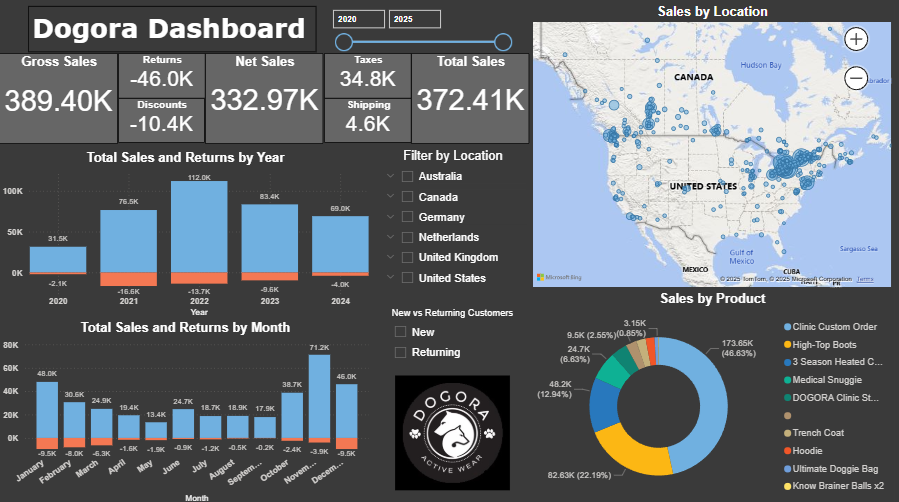
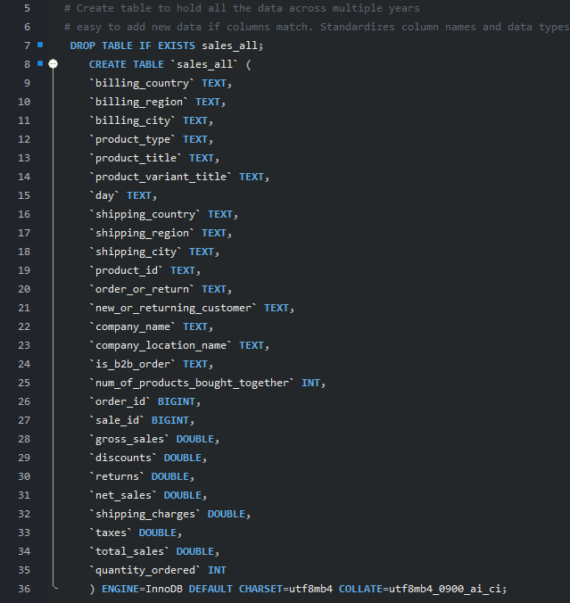
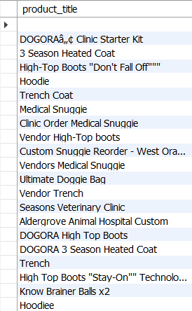
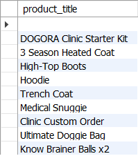
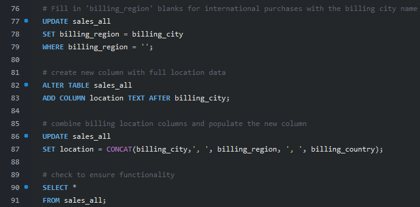

# Dogora 2020-2024 

## SQL and Power BI - Shopify Data Analysis

### by Alex Melino

## Background

Dogora (https://www.dogora.ca/) is a Canadian company that specializes in premium pet clothing including industry-leading active and medical wear, interactive toys, human apparel, and various accessories.

Dogora's sales are a combination of in-store B2B sales and Shopify online sales. The Shopify sales data comes in .csv files (found in the 'Resources' folder of this repo). Dogora's owner was in search of data analysis services to help derive better business strategies from the raw sales data including geographical data, seasonal trends, and general sales visualizations.

#
## Overview

This project uses a combination of SQL queries and Power BI to form an interactive dashboard to showcase various sales metrics for Dogora covering 2020 through the end of 2024. The dashboard can be accessed via this link:

https://app.powerbi.com/view?r=eyJrIjoiMzY3MTgwNjAtMTM4Yy00NzRmLWI0MGEtNmRiYTJmNjFjYWY5IiwidCI6IjE1M2FkZTI5LWE4YjUtNDNiYi1hNzc2LTdlZWEyNGQxYTY1YyJ9

#
## Data Cleaning using SQL

The queries used to combine and clean the data can be found in the 'dogora-queries.sql' file which is located in the main directory of this repo. 

The first query used creates a new table to hold the yearly data pulled from Shopify. The new table contains matching columns to the pulled data. 

This allows for easy addition of new data in subsequent years as long as the columns remain the same, which they should as the Shopify QL query used to pull the data has also been predefined and saved.

After populating the table, the next step is to do some standard data cleaning. In this case, the cleaning steps were to clean up the 'product_title' column and standardize the billing location columns. Below is a before and after of DISTINCT column values for the 'product_title' column:

The next step was to fill in blank values within the 'billing_region' column. The international purchases did not provide any info for this column so they were simply populated with the 'billing_city' for that row. Additionally, a new column was created called 'location' which combines the city, region, and country into one column. This was done in order to be compatible with Power BI mapping later in the project. The SQL code for that was as follows:

The last step in the SQL code creates a new and final table with ordered columns, proper column names, and proper datatypes. This table was then exported to use in Power BI to develop a dashboard and visualizations

#
## Power BI Dashboard and Visualization

The cleaned table was imported into Power BI and the dashboard was constructed using a variety of visualizations that can be interacted with. The dashboard features sales and returns data in the form of monthly and yearly charts. The dashboard has a slider at the top to select certain years or ranges. 

Additionally, the dashboard features an interactive map based on billing location data which allows the user to analyze trends from different regions. The dashboard can be filtered by country and region as well as by new or returning customers using another two slicer features.

Below is a screenshot of the dashboard. The live dashboard can be accessed using the link above in an earlier section of this ReadMe.

#
## Further Steps

Additional steps that can be taken in the future include automated data entry so that there is less input from the analyst. New data can be added and the dashboard should update by itself.

Further and deeper analysis could be obtained using python as it allows for more complex and custom analysis with a variety of possible visualizaions.

This repo will be updated yearly or as often as the client requires.