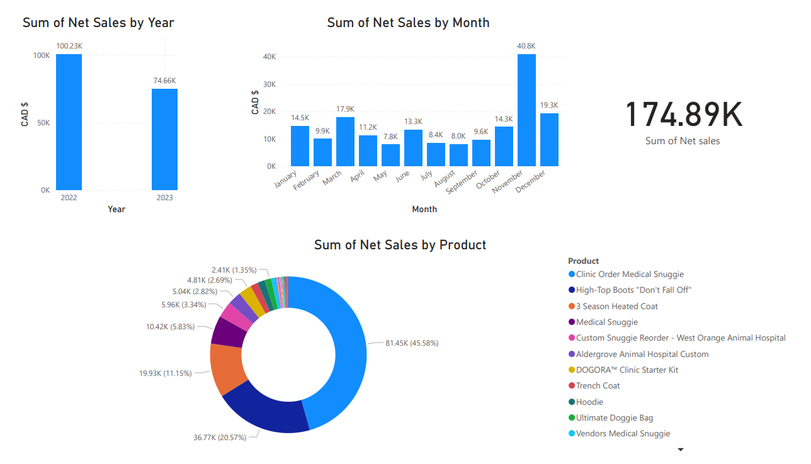
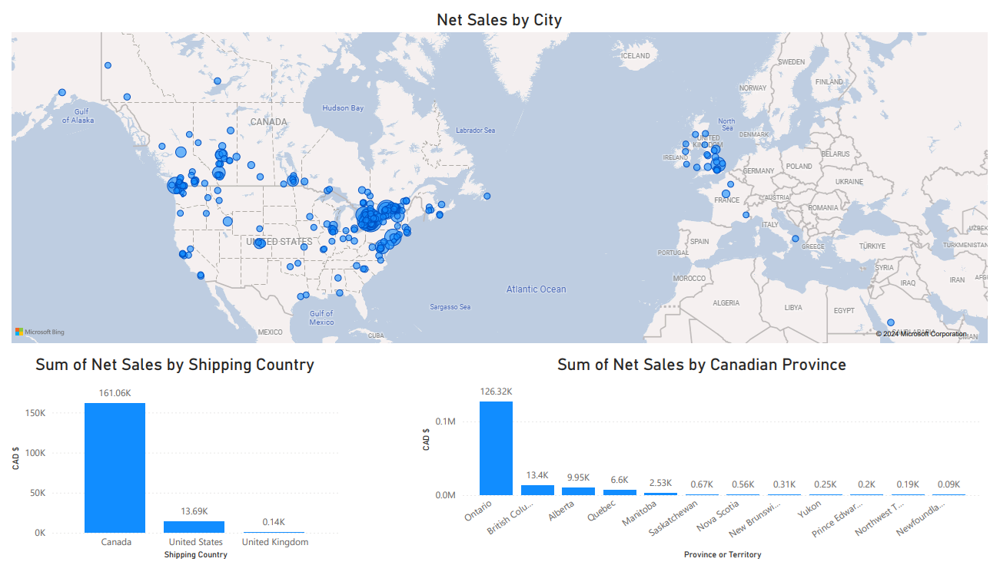
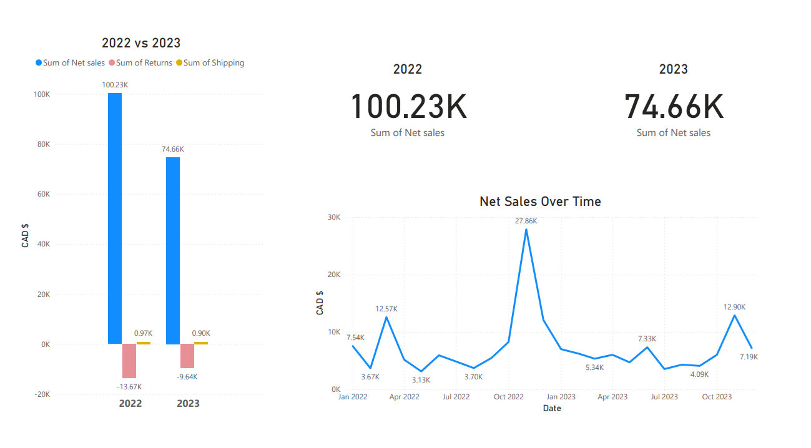
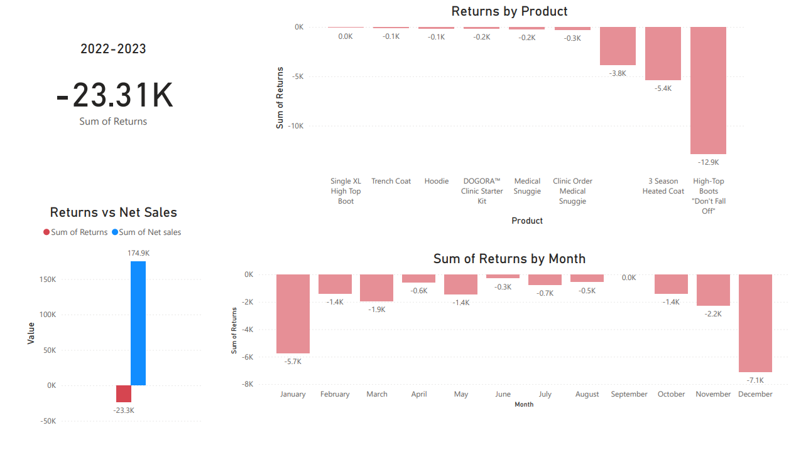

# Dogora 2022-2023 Power BI/Python Data Analysis

### by Alex Melino

#

## Background

Dogora (https://www.dogora.ca/) is a Canadian company that specializes in premium pet clothing including industry-leading active and medical wear, interactive toys, human apparel, and various accessories.

Dogora's sales are a combination of in-store B2B sales and Shopify online sales. The Shopify sales data comes in .csv files (found in the 'Resources' folder of this repo). Dogora's owner was in search of data analysis to help derive better business strategies from the raw sales data including geographical data, seasonal trends, and general sales visualizations.

#

#

## Overview

This project uses a combination of Python Programming and Power BI to form an analytical report to showcase various sales metrics for Dogora covering 2022 and 2023. The report itself pictured in the images below was created using only Power BI (free version).

The python file which was created using Jupyter Lab is called analysis.ipynb. In it can be found various visualizations created using the following libraries/dependancies: pandas, seaborn, matplotlib, numpy. These visualizations were not used in the Power BI report but were saved for reference in the 'Images' folder of this repo.
#
#
Various sales visualizations

#
Visualizations based on geographic data of the sales files

#
Net sales over time

#
Visualizations regarding returns

#
